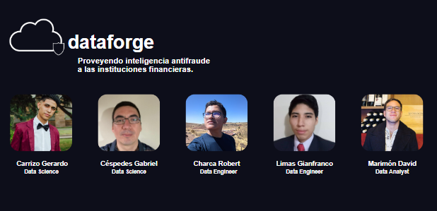

# <h1 align=center>**`Bank Fraud Detection Application`**</h1>

## 📌 Integrantes

  

<table>
  <thead>
    <tr>
      <th>Name</th>
      <th>Rol</th>
      <th></th>
      <th></th>
    </tr>
  </thead>
  <tbody>
    <tr>
      <td><b>Gabriel Céspedes</b></td>
      <td>Data Scientist</td>
      <td><a href="https://github.com/gabrielcespedes">gabrielcespedes</a></td>
      <td><a href="https://www.linkedin.com/in/gabriel-cespedes-alarcon/">Gabriel Céspedes Alarcón</a></td>
    </tr>
    <tr>
      <td><b>Robert Charca</b></td>
      <td>Data Engineer</td>
      <td><a href="https://github.com/robertcharca">robertcharca</a></td>
      <td><a href="https://www.linkedin.com/in/robert-charca-123b28293/">Robert Charca</a></td>
    </tr>
    <tr>
      <td><b>David Marimón</b></td>
      <td>Data Analyst</td>
      <td><a href="https://github.com/DaAnMaGi">DaAnMaGi</a></td>
      <td><a href="https://www.linkedin.com/in/daanmagi/">David Andrés Marimón Gil</a></td>
    </tr>
    <tr>
      <td><b>Gianfranco Limas</b></td>
      <td>Data Engineer</td>
      <td><a href="https://github.com/xlSosdee">xlSosdee</a></td>
      <td><a href="https://www.linkedin.com/in/gianfranco-limas/">Gianfranco Limas</a></td>
    </tr>
    <tr>
      <td><b>Gerardo Carrizo</b></td>
      <td>Data Scientist</td>
      <td><a href="https://github.com/Gerardgfc">Gerardgfc</a></td>
      <td><a href="https://www.linkedin.com/in/gerardo-carrizo/">Gerardo Carrizo</a></td>
    </tr>
  </tbody>
</table>

  

